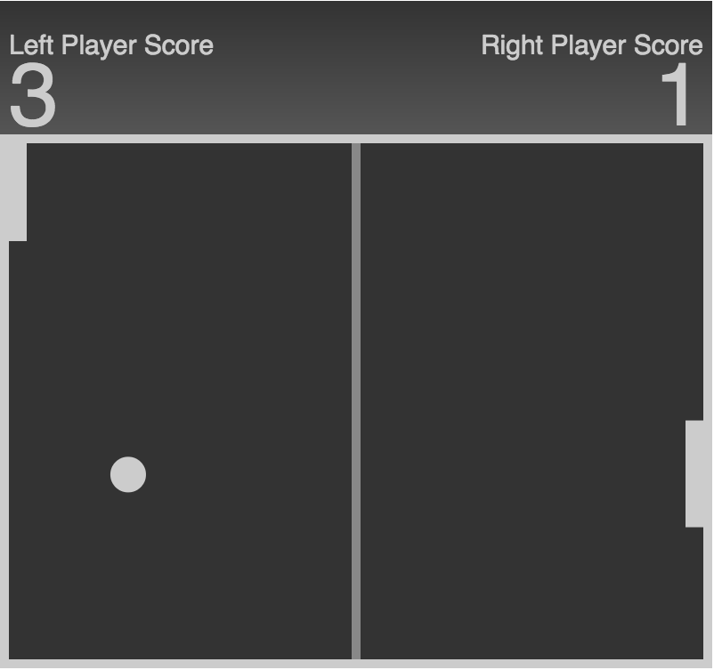

Pong!JS
=======

> A small PONGTM experiment in EcmaScript 6 and HTML5 canvas.

This is a very small experiment for myself. I just wanted to play with canvas, animations, some ECMA Script 6.
The result is a In-Browser PONG game, which can be played by 2 players ON THE SAME KEYBOARD, which turned out to be
really funny.

How to play
------------

Find the game <a href="https://alexi.ch/pong/">online, then play:

* Player 1: UP: 'a', DOWN: 'y'
* Player 2: UP: 'k', DOWN: 'm'

A Screen:

Develop
--------

### debug

* npm install
* gulp build / gulp watch

### prod

* npm install
* gulp build:prod
* gulp export # --> creates a prod build version in ./export/

(c) 2015 Alexander Schenkel, copyright license